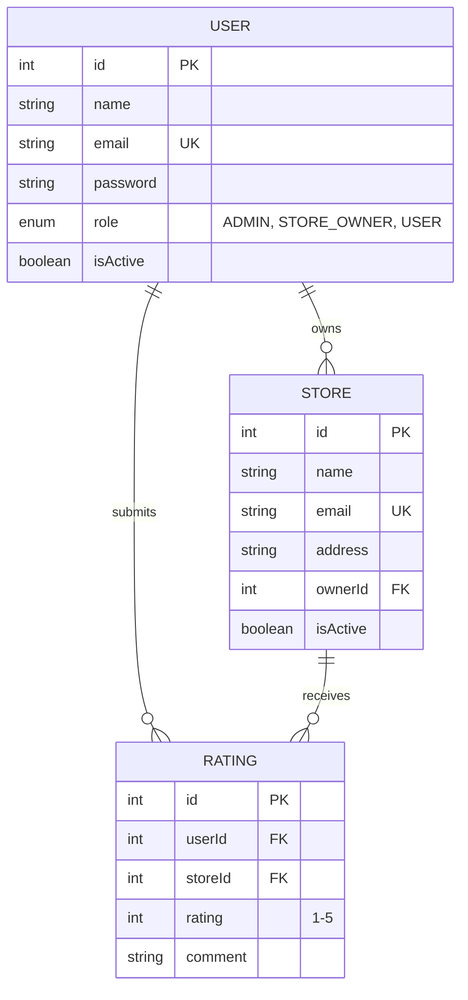

# Store Rating Platform

A full-stack web application that enables users to discover stores, submit ratings, and manage reviews with role-based access control. Demonstrates clean architecture, secure authentication, and professional software engineering practices.

---

## Project Overview

**Objective**: Build a centralized platform for store discovery and customer reviews with RBAC.

**Key Features**:
- User authentication with JWT and role-based authorization
- Store browsing with search, pagination, and filtering
- 1-5 star rating system with review comments
- Admin dashboard with platform analytics
- Store owner performance dashboard
- Comprehensive audit logging for compliance

---

## Features by User Role

### User (Regular Customer)
- Search and browse stores with pagination
- Sort by store name, address, and ratings
- Submit 1-5 star ratings with optional review comments
- Enforced one-review-per-store policy
- Password management with complexity validation
- Profile viewing and account management

### Store Owner
- Dashboard with aggregated analytics
- View all customer ratings and feedback
- Monitor average ratings and review counts
- Performance metrics visualization

### System Administrator
- User and store management (CRUD operations)
- Create accounts with role assignment
- Toggle user/store active status
- Delete users and stores
- Global search functionality
- Audit log access with activity tracking
- Platform dashboard with 30-day metrics

---

## Technology Stack

| Layer | Technology | Purpose |
|-------|-----------|---------|
| Frontend Framework | React 18 | Component-based UI with hooks |
| Build Tool | Vite | Fast bundling and HMR |
| UI Library | Material-UI (MUI v5) | Professional components |
| HTTP Client | Axios | API communication with interceptors |
| Backend Framework | Express.js | Lightweight, scalable Node.js server |
| ORM | Sequelize | Type-safe database queries |
| Database | MySQL 8.0+ | Relational data management |
| Authentication | JWT | Stateless authentication tokens |
| Security | bcryptjs | Password hashing with salt |
| Validation | express-validator | Server-side input validation |
| Documentation | Swagger UI | Interactive API documentation |
| State Management | React Context API | Global state for auth, theme, notifications

---

## Project Structure

```
├── backend/                 # Express API server
│   ├── src/
│   │   ├── config/         # Database & Swagger config
│   │   ├── controllers/    # Request handlers
│   │   ├── middleware/     # Auth & error handling
│   │   ├── models/         # Database schemas
│   │   ├── repositories/   # Data access layer
│   │   ├── services/       # Business logic
│   │   ├── routes/         # API endpoints
│   │   └── validators/     # Input validation
│   ├── server.js
│   ├── seed.js             # Database seeder
│   └── package.json
│
├── frontend/               # React application
│   ├── src/
│   │   ├── components/     # UI components
│   │   ├── context/        # State providers
│   │   ├── pages/          # Page components
│   │   ├── services/       # API client
│   │   ├── App.jsx
│   │   └── main.jsx
│   ├── vite.config.js
│   └── package.json
│
├── .gitignore
└── .env.example
```

---

## Installation & Setup

### System Requirements
- Node.js 16.0 or higher
- npm 8.0 or higher
- MySQL 8.0 or higher
- 500 MB free disk space

### Step 1: Clone Repository
```bash
git clone https://github.com/yourusername/store-rating-platform.git
cd store-rating-platform
```

### Step 2: Configure Environment Variables

**Root directory**
```bash
cp .env.example .env
```

**Backend configuration**
```bash
cd backend
cp .env.example .env
```

Edit `backend/.env` with your database credentials:
```env
DB_HOST=localhost
DB_PORT=3306
DB_USER=root
DB_PASSWORD=your_mysql_password
DB_NAME=store_rating_platform
JWT_SECRET=your_secret_key_min_32_characters
JWT_EXPIRES_IN=24h
NODE_ENV=development
CLIENT_URL=http://localhost:5173
```

**Frontend configuration**
```bash
cd ../frontend
cp .env.example .env
```

Edit `frontend/.env`:
```env
VITE_API_URL=http://localhost:5000/api
```

### Step 3: Database Setup

Ensure MySQL server is running, then:
```bash
mysql -u root -p
CREATE DATABASE store_rating_platform;
EXIT;
```

### Step 4: Install & Run Backend
```bash
cd backend
npm install

# Seed database with test data and create tables
npm run seed

# Start development server
npm run dev
```

Backend will run on **http://localhost:5000**  
API Documentation: **http://localhost:5000/api-docs**

### Step 5: Install & Run Frontend

**Open a new terminal window:**
```bash
cd frontend
npm install

# Start development server
npm run dev
```

Frontend will run on **http://localhost:5173**

### Verify Installation
- Open http://localhost:5173 in your browser
- Login with test credentials (see below)
- Verify all pages load correctly

---

## API Endpoints

Full API documentation with request/response examples available at **http://localhost:5000/api-docs**

### Authentication (Public)
```
POST   /api/auth/register          Register new user account
POST   /api/auth/login             Login and receive JWT token
GET    /api/auth/me                Get current logged-in user profile
```

### User Profile (Authenticated)
```
PUT    /api/users/change-password  Update password (requires old password)
```

### Store Browsing (Authenticated Users)
```
GET    /api/stores                 List all stores (supports pagination, search, sort)
GET    /api/stores/:storeId/reviews Get all reviews for a specific store
```

### Ratings & Reviews (Users Only)
```
POST   /api/ratings                Submit new rating (1-5 stars)
PUT    /api/ratings/:storeId       Update existing rating for a store
```

### Admin Operations (Admin Only)
```
GET    /api/admin/dashboard        Platform metrics and 30-day analytics
POST   /api/admin/users            Create user account (any role)
POST   /api/admin/stores           Create store and assign to owner
GET    /api/admin/users            List all users (paginated, searchable)
GET    /api/admin/users/:id        Get user details with metrics
PATCH  /api/admin/users/:id/status Toggle user active/inactive
DELETE /api/admin/users/:id        Delete user account
GET    /api/admin/stores           List all stores
PATCH  /api/admin/stores/:id/status Toggle store active/inactive
DELETE /api/admin/stores/:id       Delete store
GET    /api/admin/ratings          List all ratings
GET    /api/admin/global-search    Search users and stores by name
GET    /api/admin/audit-logs       View activity audit trail
```

### Store Owner Operations (Store Owner Only)
```
GET    /api/store-owner/dashboard  Owner dashboard with analytics
GET    /api/store-owner/ratings    List of ratings for owned stores
```

---

## Architecture & Design Patterns

### Architectural Layers

**Frontend Layer**
- React components with hooks
- React Context API for state management
- Material-UI components for professional UI
- Axios for API communication

**API Layer (Express.js)**
- RESTful endpoints following REST conventions
- Middleware-based request/response pipeline
- Input validation using express-validator

**Service Layer**
- Business logic isolated from controllers
- Service classes handle complex operations
- Transaction management and error handling

**Data Access Layer**
- Repository pattern for database operations
- Sequelize ORM for SQL abstraction
- Reusable query methods

**Database Layer**
- MySQL relational database
- Sequelize models with associations
- Migrations and seeding support

### Design Principles Applied

- **Single Responsibility**: Each layer has distinct responsibility
- **Separation of Concerns**: Controllers, services, repositories cleanly separated
- **DRY (Don't Repeat Yourself)**: Reusable validation, error handling
- **SOLID Principles**: Loose coupling, high cohesion
- **Clean Code**: Clear naming, proper structure, comments where needed

---

## Database Schema

### Entity Relationship Diagram



### Table Details

**Users Table**
- `id`: Primary key, auto-increment
- `name`: 20-60 characters, required
- `email`: Unique identifier, required
- `password`: Bcrypt hashed, never stored in plaintext
- `address`: 0-400 characters
- `role`: ENUM (ADMIN, STORE_OWNER, USER) - default: USER
- `isActive`: Boolean flag for account status

**Stores Table**
- `id`: Primary key, auto-increment
- `name`: Store name, required
- `email`: Unique store email
- `address`: Physical location, 0-400 characters
- `ownerId`: Foreign key to User (STORE_OWNER)
- `isActive`: Boolean flag for visibility

**Ratings Table**
- `id`: Primary key, auto-increment
- `userId`: Foreign key to User
- `storeId`: Foreign key to Store
- `rating`: Integer 1-5, required
- `comment`: Optional review text, max 500 characters
- **Unique Constraint**: (userId, storeId) - ensures one rating per user per store

**Audit Logs Table**
- `id`: Primary key, auto-increment
- `action`: Description of action taken
- `performedBy`: Foreign key to User who performed action
- `targetId`: ID of affected entity
- `details`: JSON details of the change
- `createdAt`: Timestamp (insert-only, no updates)

---

## Security Implementation

### Authentication & Authorization
- **JWT Authentication**: Stateless token-based auth with 24-hour expiration
- **Password Security**: Bcryptjs hashing with salt factor 10
- **RBAC**: Three distinct roles (ADMIN, STORE_OWNER, USER) with enforced permissions
- **Token Validation**: Middleware validates JWT on protected routes

### Input Validation & Sanitization
- **Server-Side Validation**: express-validator on all API endpoints
- **Email Validation**: RFC 5322 compliant email verification
- **Password Requirements**: Minimum 8 chars, uppercase letter, special character
- **Field Length Constraints**: Name (20-60 chars), Address (0-400 chars), Comments (0-500 chars)
- **XSS Prevention**: Input sanitization and output encoding

### Data Protection
- **SQL Injection Prevention**: Parameterized queries via Sequelize ORM
- **Unique Constraints**: Database enforces unique user email and composite (userId, storeId) ratings
- **Referential Integrity**: Foreign key constraints prevent orphaned records
- **Audit Logging**: All admin actions logged with user, timestamp, and details

### Environment Security
- **Secrets Management**: Sensitive data stored in .env files (never committed)
- **CORS Protection**: API accepts requests only from trusted frontend domain
- **Error Handling**: Generic error messages in production, detailed logs server-side

---

## Test Credentials

After running `npm run seed`, use these accounts to test different roles:

| Role | Email | Password |
|------|-------|----------|
| **Admin** | admin@platform.com | Password123! |
| **Store Owner** | owner1@store.com | Password123! |
| **Regular User** | user1@consumer.com | Password123! |

**Additional Test Users**: `user2@consumer.com` to `user20@consumer.com` (all with Password123!)

---

## Development & Build Scripts

### Backend Scripts
```bash
npm run dev         # Start development server with auto-reload (nodemon)
npm start           # Start production server
npm run seed        # Populate database with test users, stores, and ratings
```

### Frontend Scripts
```bash
npm run dev         # Start Vite dev server with HMR
npm run build       # Build optimized production bundle (dist/)
npm run preview     # Preview production build locally
```

---

## Production Deployment

### Frontend Build
```bash
cd frontend
npm run build
# Creates optimized dist/ folder with minified assets
```

### Backend Production
```bash
cd backend
NODE_ENV=production npm install
npm start
```

### Environment Variables (Production)
```env
# Backend
NODE_ENV=production
PORT=5000
DB_HOST=your_production_db_host
DB_USER=production_user
DB_PASSWORD=strong_random_password
DB_NAME=store_rating_platform
JWT_SECRET=very_long_random_string_min_32_chars
CLIENT_URL=https://yourdomain.com

# Frontend
VITE_API_URL=https://api.yourdomain.com/api
```

### Deployment Checklist
- [ ] Use HTTPS/SSL certificates
- [ ] Store secrets in environment variables
- [ ] Enable database backups
- [ ] Configure database for production (connection pooling)
- [ ] Setup CORS for production domain only
- [ ] Enable monitoring and error logging
- [ ] Verify JWT_SECRET is strong and unique

---

## Environment Variables

### Backend
```env
PORT=5000
DB_HOST=localhost
DB_USER=root
DB_PASSWORD=password
DB_NAME=store_rating_platform
JWT_SECRET=secret_key
JWT_EXPIRES_IN=24h
NODE_ENV=development
CLIENT_URL=http://localhost:5173
```

### Frontend
```env
VITE_API_URL=http://localhost:5000/api
```

⚠️ **Never commit .env files**

---

## Future Features

- Photo uploads for stores and reviews
- Email notifications
- Store owner responses to reviews
- Advanced search filters
- Mobile app
- Two-factor authentication
- Review analytics and sentiment analysis

---

## License

MIT License

---

**Version**: 1.0.0 | **Last Updated**: June 2024
