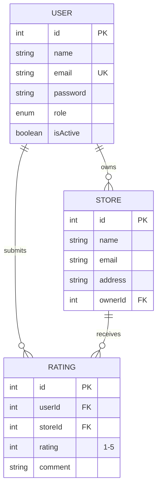

# Store Rating Platform

A full-stack web application for browsing stores, submitting ratings, and managing reviews. Built with React, Node.js, and MySQL.

---

## Overview

**Purpose**: Centralized store discovery and review platform with role-based access control.

**Key Features**:
- User authentication and authorization
- Store browsing with search and filtering
- 5-star rating and review system
- Admin dashboard with analytics
- Store owner insights and metrics
- Comprehensive audit logging

---

## Features by Role

### Regular Users
- Browse and search stores
- Submit ratings (1-5 stars) and reviews
- View other users' reviews
- Update password
- Dark/light theme toggle

### Store Owners
- Dashboard with store performance metrics
- View customer ratings and comments
- Track average ratings and review counts

### Administrators
- User and store management
- Platform analytics and metrics
- Global search across users and stores
- Audit log access
- 30-day growth tracking

---

## Tech Stack

| Component | Technology |
|-----------|-----------|
| Frontend | React 18, Vite, Material-UI (MUI v5), Axios |
| Backend | Node.js, Express.js, Sequelize ORM |
| Database | MySQL 8.0+ |
| Authentication | JWT (24-hour expiration) |
| Security | bcryptjs, express-validator, RBAC |
| Documentation | Swagger OpenAPI |

---

## Project Structure

```
├── backend/                 # Express API server
│   ├── src/
│   │   ├── config/         # Database & Swagger config
│   │   ├── controllers/    # Request handlers
│   │   ├── middleware/     # Auth & error handling
│   │   ├── models/         # Database schemas
│   │   ├── repositories/   # Data access layer
│   │   ├── services/       # Business logic
│   │   ├── routes/         # API endpoints
│   │   └── validators/     # Input validation
│   ├── server.js
│   ├── seed.js             # Database seeder
│   └── package.json
│
├── frontend/               # React application
│   ├── src/
│   │   ├── components/     # UI components
│   │   ├── context/        # State providers
│   │   ├── pages/          # Page components
│   │   ├── services/       # API client
│   │   ├── App.jsx
│   │   └── main.jsx
│   ├── vite.config.js
│   └── package.json
│
├── .gitignore
└── .env.example
```

---

## Installation

### Prerequisites
- Node.js 16+
- npm 8+
- MySQL 8.0+

### Setup

**1. Clone and Configure**
```bash
git clone <repository-url>
cd store-rating-platform

# Copy environment files
cp .env.example .env
cd backend && cp .env.example .env && cd ..
cd frontend && cp .env.example .env && cd ..
```

**2. Update backend/.env**
```env
DB_HOST=localhost
DB_USER=root
DB_PASSWORD=your_password
DB_NAME=store_rating_platform
JWT_SECRET=your_secret_key
```

**3. Start Backend**
```bash
cd backend
npm install
npm run seed        # Create tables and seed test data
npm run dev         # Start development server
```

**4. Start Frontend** (new terminal)
```bash
cd frontend
npm install
npm run dev
```

### Access
- Frontend: http://localhost:5173
- Backend: http://localhost:5000
- API Docs: http://localhost:5000/api-docs

---

## API Endpoints

### Authentication
```
POST   /api/auth/register          Register user
POST   /api/auth/login             Login user
GET    /api/auth/me                Current user profile
```

### Stores
```
GET    /api/stores                 List stores (paginated)
GET    /api/stores/:id/reviews     Get store reviews
```

### Ratings (Users Only)
```
POST   /api/ratings                Submit new rating
PUT    /api/ratings/:storeId       Update rating
```

### Admin
```
GET    /api/admin/dashboard        Platform metrics
POST   /api/admin/users            Create user
POST   /api/admin/stores           Create store
GET    /api/admin/users            List users
GET    /api/admin/audit-logs       View audit logs
```

### Store Owner
```
GET    /api/store-owner/dashboard  Store owner metrics
GET    /api/store-owner/ratings    View customer ratings
```

---

## Database Schema



---

## Security

- **Password Hashing**: bcryptjs (salt factor: 10)
- **Authentication**: JWT with 24-hour expiration
- **Authorization**: Role-based access control (RBAC)
- **Input Validation**: Server-side validation
- **SQL Safety**: Parameterized queries (Sequelize)
- **Audit Logs**: Track admin actions
- **CORS**: Restricted to trusted origins

---

## Test Credentials

```
Admin       | admin@platform.com      | Password123!
Store Owner | owner1@store.com        | Password123!
User        | user1@consumer.com      | Password123!
```

---

## Scripts

**Backend**
```bash
npm run dev         # Development server with auto-reload
npm start           # Production server
npm run seed        # Seed database with test data
```

**Frontend**
```bash
npm run dev         # Development server
npm run build       # Production build
npm run preview     # Preview production build
```

---

## Deployment

**Frontend**
```bash
cd frontend
npm run build       # Creates dist/ folder
```

**Backend**
```bash
cd backend
NODE_ENV=production npm install
npm start
```

---

## Environment Variables

### Backend
```env
PORT=5000
DB_HOST=localhost
DB_USER=root
DB_PASSWORD=password
DB_NAME=store_rating_platform
JWT_SECRET=secret_key
JWT_EXPIRES_IN=24h
NODE_ENV=development
CLIENT_URL=http://localhost:5173
```

### Frontend
```env
VITE_API_URL=http://localhost:5000/api
```

⚠️ **Never commit .env files**

---

## Future Features

- Photo uploads for stores and reviews
- Email notifications
- Store owner responses to reviews
- Advanced search filters
- Mobile app
- Two-factor authentication
- Review analytics and sentiment analysis

---

## License

MIT License

---

**Version**: 1.0.0 | **Last Updated**: June 2024
