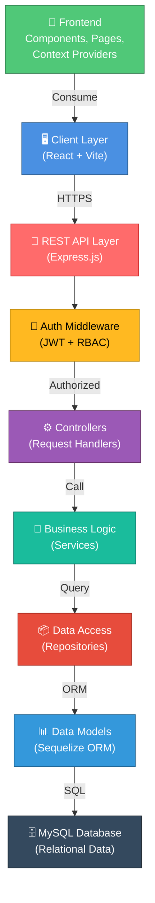
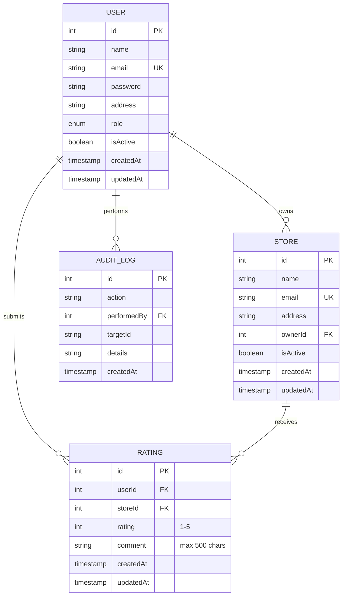
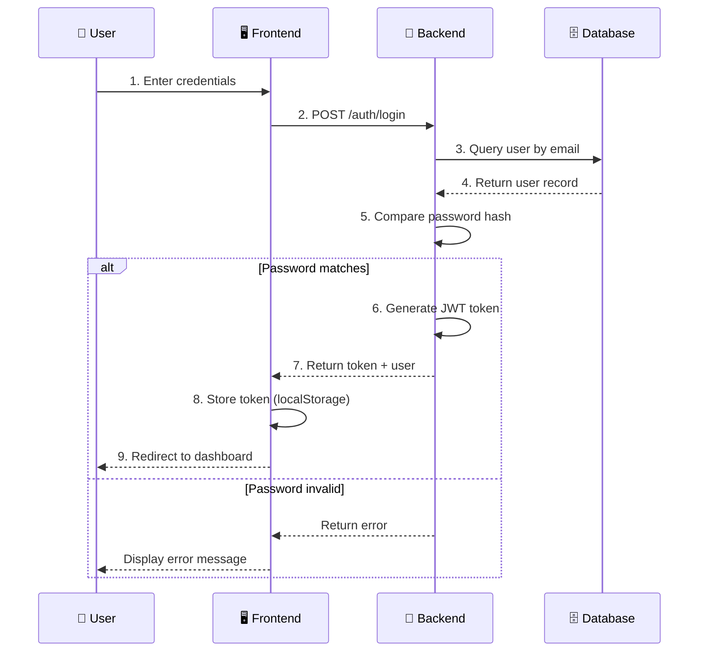
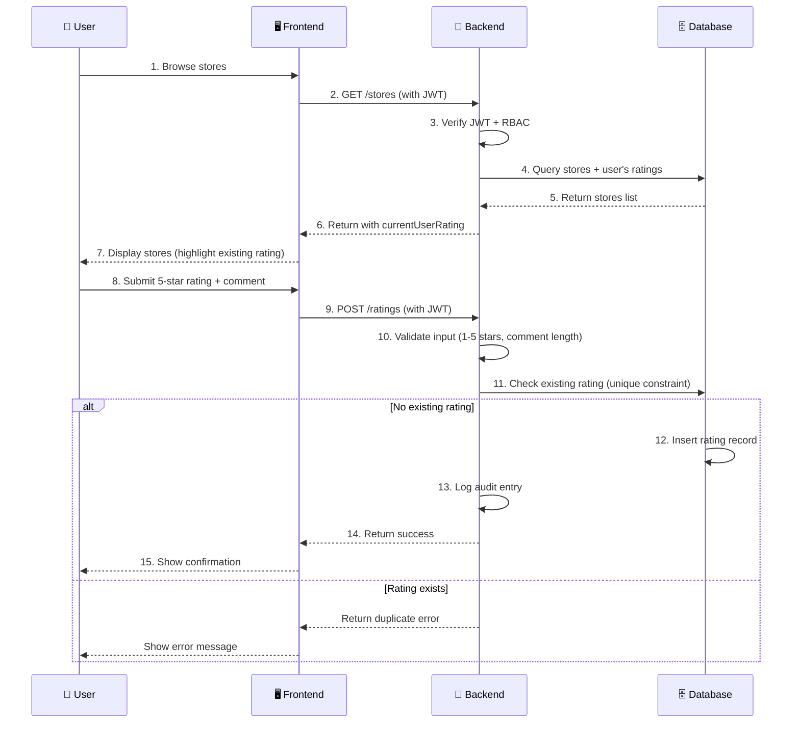
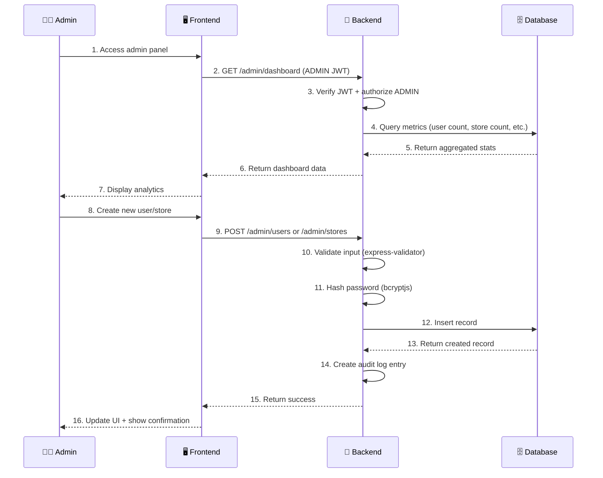

# Store Rating Platform

A **production-ready, full-stack application** designed to enable users to search, browse, rate, and review physical store outlets. The platform implements comprehensive **Role-Based Access Control (RBAC)** supporting System Administrators, Store Owners, and Normal Users. Built with clean architecture principles, the application demonstrates decoupled MVC design patterns on the backend and structured React Context API state management on the frontend—making it an excellent portfolio project for internship evaluations and technical reviews.

---

## Project Overview

### Business Problem
Physical store discovery and customer feedback aggregation lacks a centralized, user-friendly platform. Store owners struggle to manage customer reviews systematically, while customers cannot easily compare store experiences or provide structured feedback.

### Solution
The Store Rating Platform provides a comprehensive ecosystem where:
- **Regular Users** discover stores, leave ratings and reviews, and track their feedback history
- **Store Owners** monitor customer reviews, analyze performance metrics, and respond to feedback
- **System Administrators** manage platform governance, user accounts, and compliance oversight

### Target Users
- **Primary**: Regular consumers aged 18-65 seeking store information and review communities
- **Secondary**: Small-to-medium store owners managing customer relationships
- **Tertiary**: Platform administrators ensuring compliance and system health

### Key Objectives
✓ Enable intuitive store discovery and review mechanisms  
✓ Implement role-based access control with granular permissions  
✓ Provide real-time analytics and performance dashboards  
✓ Ensure data security through encryption and validation layers  
✓ Maintain audit trails for compliance and transparency  

---

## Features

### User Features (Role: USER)
- **Store Discovery**: Search, filter, and sort stores by name, address, and ratings
- **Rating & Reviews**: Submit 1-5 star ratings with optional detailed comments (max 500 characters)
- **One Review Per Store**: Automatic enforcement preventing duplicate reviews from the same user
- **Profile Management**: Update password with complexity validation (uppercase, special chars, minimum length)
- **Notification System**: Real-time feedback for actions (success, error, warning states)
- **Dark/Light Theme**: Customizable UI theme preference
- **Responsive Design**: Fully optimized for desktop, tablet, and mobile devices

### Store Owner Features (Role: STORE_OWNER)
- **Dashboard Analytics**: 
  - Average store rating across all owned properties
  - Total review count and detailed distribution
  - Bar chart visualization of 1-5 star score breakdown
- **Review Management**: View all customer ratings and comments for owned stores
- **Store-Specific Metrics**: Performance tracking for multiple store locations
- **Comparative Analysis**: Identify trends and improvement opportunities

### Admin Features (Role: ADMIN)
- **Dashboard Metrics**: 
  - Total active users, stores, and ratings
  - 30-day growth analytics with trend visualization
  - Platform health indicators
- **User Management**: 
  - Create accounts for any role (ADMIN, STORE_OWNER, USER)
  - Toggle user active/inactive status
  - Delete accounts with cascading permissions
  - Search and filter users with pagination
- **Store Management**: 
  - Create and associate stores with store owners
  - Toggle store visibility
  - Delete store records
  - View all platform stores with management controls
- **Global Search**: Search across all usernames and store names simultaneously
- **Audit Logging**: Complete activity trails recording user creations, store additions, and rating events

---

## System Architecture

### Architecture Diagram



### Architectural Components

**Frontend Layer** (React + Vite)
- Component-based UI architecture with reusable components
- React Context API for global state management (Auth, Theme, Notifications)
- Material-UI (MUI v5) for professional styling
- Axios for centralized API communication
- Client-side validation and error handling

**Backend Layer** (Express.js)
- RESTful API following REST conventions
- Modular controller-based request handling
- Service layer for business logic isolation
- Repository pattern for data access abstraction
- Middleware chain for authentication, authorization, and error handling

**Database Layer** (MySQL + Sequelize)
- Relational schema with foreign key constraints
- Sequelize ORM for type-safe queries
- Automatic table synchronization and migrations
- Database seeding for development/testing

**Cross-Cutting Concerns**
- JWT-based authentication with secure token validation
- Role-Based Access Control (RBAC) with three distinct roles
- Input validation and sanitization
- Centralized error handling
- Request/response logging (Morgan)
- Audit logging for compliance

---

## Technology Stack

| Layer | Technology | Purpose |
|-------|-----------|---------|
| **Frontend Framework** | React 18.3+ | Component-based UI rendering |
| **Frontend Build Tool** | Vite 5+ | Fast module bundling and HMR |
| **Frontend Routing** | React Router v6 | Client-side page navigation |
| **State Management** | React Context API | Global state (Auth, Theme, Notifications) |
| **UI Component Library** | Material-UI (MUI v5) | Professional pre-built components |
| **HTTP Client** | Axios 1.7+ | Simplified API communication |
| **Visualization** | Recharts 2.12+ | Interactive charts and analytics |
| **Backend Framework** | Express.js 4.19+ | Node.js web server framework |
| **ORM** | Sequelize 6.37+ | SQL query builder and migrations |
| **Database** | MySQL 8.0+ | Relational database management |
| **Authentication** | JWT (jsonwebtoken) | Stateless authentication tokens |
| **Password Security** | bcryptjs 2.4+ | Password hashing and verification |
| **Input Validation** | express-validator 7.1+ | Server-side request validation |
| **API Documentation** | Swagger UI + JSDoc | Interactive API documentation |
| **HTTP Logging** | Morgan 1.10+ | Request/response logging |
| **CORS** | cors 2.8+ | Cross-origin request handling |
| **Environment Variables** | dotenv 16.4+ | Configuration management |
| **Development Monitor** | Nodemon 3.1+ | Auto-restart on file changes |

---

## Folder Structure

```
store-rating-platform/
├── backend/
│   ├── src/
│   │   ├── config/
│   │   │   ├── db.config.js              # Database connection configuration
│   │   │   └── swagger.js                # Swagger API documentation spec
│   │   ├── controllers/
│   │   │   ├── admin.controller.js       # Admin operations handler
│   │   │   ├── auth.controller.js        # Authentication & registration handler
│   │   │   ├── rating.controller.js      # Rating submission & updates
│   │   │   ├── store.controller.js       # Store browsing & details
│   │   │   └── storeOwner.controller.js  # Store owner dashboard
│   │   ├── middleware/
│   │   │   ├── auth.middleware.js        # JWT verification & RBAC authorization
│   │   │   └── error.middleware.js       # Centralized error handling
│   │   ├── models/
│   │   │   ├── index.js                  # Model associations & exports
│   │   │   ├── user.model.js             # User schema (ADMIN, STORE_OWNER, USER)
│   │   │   ├── store.model.js            # Store schema with owner relationship
│   │   │   ├── rating.model.js           # Rating/Review schema
│   │   │   └── auditLog.model.js         # Audit trail schema
│   │   ├── repositories/
│   │   │   ├── user.repository.js        # User CRUD operations
│   │   │   ├── store.repository.js       # Store queries
│   │   │   ├── rating.repository.js      # Rating queries
│   │   │   └── auditLog.repository.js    # Audit log queries
│   │   ├── services/
│   │   │   ├── auth.service.js           # Authentication business logic
│   │   │   ├── admin.service.js          # Admin operations logic
│   │   │   ├── store.service.js          # Store service logic
│   │   │   ├── rating.service.js         # Rating/Review business logic
│   │   │   ├── storeOwner.service.js     # Store owner logic
│   │   │   └── auditLog.service.js       # Audit logging logic
│   │   ├── validators/
│   │   │   ├── auth.validator.js         # Register/login validation rules
│   │   │   ├── admin.validator.js        # Admin operation validation
│   │   │   ├── rating.validator.js       # Rating submission validation
│   │   │   └── validationHelper.js       # Shared validation utilities
│   │   ├── utils/
│   │   │   └── customErrors.js           # Custom exception definitions
│   │   ├── routes/
│   │   │   ├── index.js                  # Route aggregator
│   │   │   ├── auth.routes.js            # /api/auth endpoints
│   │   │   ├── user.routes.js            # /api/users endpoints
│   │   │   ├── admin.routes.js           # /api/admin endpoints (ADMIN only)
│   │   │   ├── store.routes.js           # /api/stores endpoints
│   │   │   ├── rating.routes.js          # /api/ratings endpoints (USER only)
│   │   │   └── storeOwner.routes.js      # /api/store-owner endpoints
│   │   └── server.js                     # Express app initialization & startup
│   ├── seed.js                           # Database seeder with test data
│   ├── .env.example                      # Environment variables template
│   ├── package.json                      # Node dependencies & scripts
│   └── Dockerfile                        # Docker containerization
│
├── frontend/
│   ├── src/
│   │   ├── components/
│   │   │   ├── ErrorBoundary.jsx         # React error boundary wrapper
│   │   │   ├── Layout.jsx                # Main layout wrapper
│   │   │   ├── Navbar.jsx                # Navigation header component
│   │   │   ├── Sidebar.jsx               # Navigation sidebar
│   │   │   ├── StatCard.jsx              # Statistics display card
│   │   │   └── StoreReviewsDialog.jsx    # Review modal component
│   │   ├── context/
│   │   │   ├── AuthContext.jsx           # Authentication global context
│   │   │   ├── NotificationContext.jsx   # Toast notifications context
│   │   │   └── ThemeModeContext.jsx      # Dark/Light theme context
│   │   ├── pages/
│   │   │   ├── Login.jsx                 # User login page
│   │   │   ├── Register.jsx              # User registration page
│   │   │   ├── Profile.jsx               # User profile management
│   │   │   ├── admin/
│   │   │   │   ├── Dashboard.jsx         # Admin dashboard with metrics
│   │   │   │   ├── UsersManagement.jsx   # User CRUD operations
│   │   │   │   ├── UserDetails.jsx       # Individual user details
│   │   │   │   ├── StoresManagement.jsx  # Store CRUD operations
│   │   │   │   └── ReviewsManagement.jsx # Platform-wide review management
│   │   │   ├── storeOwner/
│   │   │   │   ├── Dashboard.jsx         # Store owner dashboard
│   │   │   │   └── RatingsList.jsx       # List of received ratings
│   │   │   └── user/
│   │   │       └── Dashboard.jsx         # Regular user dashboard (store listing)
│   │   ├── services/
│   │   │   └── api.js                    # Axios instance & API endpoints
│   │   ├── theme.js                      # Material-UI theme configuration
│   │   ├── App.jsx                       # Root component with routing
│   │   └── main.jsx                      # React DOM mount point
│   ├── index.html                        # HTML entry point
│   ├── vite.config.js                    # Vite build configuration
│   ├── .env.example                      # Frontend environment variables
│   ├── package.json                      # Node dependencies & scripts
│   ├── Dockerfile                        # Docker containerization
│   └── nginx.conf                        # Nginx config for production SPA routing
│
├── .env.example                          # Root environment file template
├── docker-compose.yml                    # Multi-container orchestration
└── README.md                             # Project documentation
```

---

## Installation Guide

### Prerequisites

| Requirement | Version | Purpose |
|-------------|---------|---------|
| **Node.js** | 16.x or higher | Runtime environment |
| **npm** | 8.x or higher | Package manager |
| **MySQL Server** | 8.0 or higher | Database server |
| **Git** | 2.x or higher | Version control |

**System Requirements:**
- 2GB+ RAM minimum
- 500MB+ free disk space
- Active internet connection for package downloads

### Step 1: Clone Repository

```bash
git clone https://github.com/yourusername/store-rating-platform.git
cd store-rating-platform
```

### Step 2: Configure Environment Variables

Copy the environment template files and update with your credentials:

```bash
# Root directory
cp .env.example .env

# Backend configuration
cd backend
cp .env.example .env
```

Edit `backend/.env` with your MySQL credentials:

```env
PORT=5000
DB_HOST=localhost
DB_PORT=3306
DB_USER=root
DB_PASSWORD=your_mysql_password
DB_NAME=store_rating_platform
JWT_SECRET=your_secure_jwt_secret_key_here
JWT_EXPIRES_IN=24h
NODE_ENV=development
CLIENT_URL=http://localhost:5173
```

Edit `frontend/.env` with API endpoint:

```env
VITE_API_URL=http://localhost:5000/api
```

### Step 3: Create MySQL Database

```bash
# Login to MySQL
mysql -u root -p

# Create database (or run seed.js which creates it automatically)
CREATE DATABASE store_rating_platform;
EXIT;
```

### Step 4: Setup & Run Backend

```bash
cd backend
npm install

# Seed database with test data (creates tables and populates test records)
npm run seed

# Start development server with auto-reload
npm run dev
# OR start production server
npm start
```

Backend will be available at `http://localhost:5000`
Swagger API docs: `http://localhost:5000/api-docs`

### Step 5: Setup & Run Frontend

In a new terminal:

```bash
cd frontend
npm install

# Start development server with hot reload
npm run dev
```

Frontend will be available at `http://localhost:5173`

### Step 6: Access Application

Open your browser and navigate to:
```
http://localhost:5173
```

---

## Environment Variables

### Backend Configuration

```env
# Server
PORT=5000                                    # Express server port
NODE_ENV=development                         # Environment (development/production/test)

# Database
DB_HOST=localhost                           # MySQL server hostname
DB_PORT=3306                                # MySQL server port
DB_USER=root                                # MySQL username
DB_PASSWORD=your_password_here              # MySQL password (DO NOT COMMIT)
DB_NAME=store_rating_platform              # Database name

# Authentication
JWT_SECRET=your_secure_secret_key_here      # JWT signing secret (DO NOT COMMIT)
JWT_EXPIRES_IN=24h                          # Token expiration duration

# CORS & Client
CLIENT_URL=http://localhost:5173            # Frontend URL for CORS

# Features
DB_ALTER=false                              # Sequelize auto-alter tables flag
```

### Frontend Configuration

```env
# API Endpoint
VITE_API_URL=http://localhost:5000/api      # Backend API base URL
```

**⚠️ Security Notes:**
- Never commit `.env` files to version control
- Use strong, random JWT secrets (minimum 32 characters)
- Rotate JWT secrets in production regularly
- Use different credentials for development and production
- Store sensitive values in secure secret management systems (AWS Secrets Manager, HashiCorp Vault, etc.)

---

## API Documentation

### Full Interactive Documentation

Access comprehensive Swagger documentation with request/response examples:
```
http://localhost:5000/api-docs
```

### API Endpoints Reference

#### Authentication Endpoints

| Method | Endpoint | Description | Auth Required |
|--------|----------|-------------|----------------|
| `POST` | `/api/auth/register` | Register new user (forces USER role) | No |
| `POST` | `/api/auth/login` | Authenticate user, returns JWT token | No |
| `GET` | `/api/auth/me` | Get current logged-in user profile | Yes |

#### User Endpoints

| Method | Endpoint | Description | Auth Required | Role Required |
|--------|----------|-------------|----------------|---------------|
| `PUT` | `/api/users/change-password` | Update user password | Yes | Any |

#### Store Endpoints

| Method | Endpoint | Description | Auth Required | Role Required |
|--------|----------|-------------|----------------|---------------|
| `GET` | `/api/stores` | Get all stores (paginated, searchable, sortable) | Yes | USER |
| `GET` | `/api/stores/:storeId/reviews` | Get reviews for specific store | Yes | USER |

#### Rating Endpoints (Normal Users Only)

| Method | Endpoint | Description | Auth Required | Role Required |
|--------|----------|-------------|----------------|---------------|
| `POST` | `/api/ratings` | Submit new rating (1-5 stars) | Yes | USER |
| `PUT` | `/api/ratings/:storeId` | Update existing rating | Yes | USER |

#### Admin Endpoints

| Method | Endpoint | Description | Auth Required | Role Required |
|--------|----------|-------------|----------------|---------------|
| `GET` | `/api/admin/dashboard` | Dashboard metrics & 30-day analytics | Yes | ADMIN |
| `POST` | `/api/admin/users` | Create user of any role | Yes | ADMIN |
| `POST` | `/api/admin/stores` | Create and assign store to owner | Yes | ADMIN |
| `GET` | `/api/admin/users` | Get paginated user list | Yes | ADMIN |
| `GET` | `/api/admin/users/:id` | Get user details with store metrics | Yes | ADMIN |
| `PATCH` | `/api/admin/users/:id/status` | Toggle user active/inactive | Yes | ADMIN |
| `DELETE` | `/api/admin/users/:id` | Delete user account | Yes | ADMIN |
| `GET` | `/api/admin/stores` | Get all stores (admin view) | Yes | ADMIN |
| `PATCH` | `/api/admin/stores/:id/status` | Toggle store visibility | Yes | ADMIN |
| `DELETE` | `/api/admin/stores/:id` | Delete store | Yes | ADMIN |
| `GET` | `/api/admin/ratings` | Get all ratings (platform-wide) | Yes | ADMIN |
| `GET` | `/api/admin/global-search?q=...` | Search users and stores | Yes | ADMIN |
| `GET` | `/api/admin/audit-logs` | Get audit trail of platform activities | Yes | ADMIN |

#### Store Owner Endpoints

| Method | Endpoint | Description | Auth Required | Role Required |
|--------|----------|-------------|----------------|---------------|
| `GET` | `/api/store-owner/dashboard` | Dashboard with owned stores analytics | Yes | STORE_OWNER |
| `GET` | `/api/store-owner/ratings` | Ratings for all owned stores | Yes | STORE_OWNER |

---

## Database Design

### Entity Relationship Diagram



### Database Schema Details

#### Users Table
| Column | Type | Constraints | Description |
|--------|------|-------------|-------------|
| `id` | INTEGER | PRIMARY KEY, AUTO_INCREMENT | User identifier |
| `name` | VARCHAR(60) | NOT NULL, LENGTH: 20-60 | User full name (min 20 chars for data consistency) |
| `email` | VARCHAR(255) | NOT NULL, UNIQUE | User email address |
| `password` | VARCHAR(255) | NOT NULL | Bcrypt hashed password (salt factor: 10) |
| `address` | VARCHAR(400) | NOT NULL, LENGTH: 0-400 | User address |
| `role` | ENUM | NOT NULL, DEFAULT: USER | User role (ADMIN, STORE_OWNER, USER) |
| `isActive` | BOOLEAN | NOT NULL, DEFAULT: true | Account status flag |
| `createdAt` | TIMESTAMP | AUTO | Record creation timestamp |
| `updatedAt` | TIMESTAMP | AUTO | Last update timestamp |

#### Stores Table
| Column | Type | Constraints | Description |
|--------|------|-------------|-------------|
| `id` | INTEGER | PRIMARY KEY, AUTO_INCREMENT | Store identifier |
| `name` | VARCHAR(255) | NOT NULL | Store business name |
| `email` | VARCHAR(255) | NOT NULL, UNIQUE | Store contact email |
| `address` | VARCHAR(400) | NOT NULL | Store physical address |
| `ownerId` | INTEGER | NOT NULL, FOREIGN KEY | Reference to user (STORE_OWNER) |
| `isActive` | BOOLEAN | NOT NULL, DEFAULT: true | Store visibility flag |
| `createdAt` | TIMESTAMP | AUTO | Record creation timestamp |
| `updatedAt` | TIMESTAMP | AUTO | Last update timestamp |

#### Ratings Table
| Column | Type | Constraints | Description |
|--------|------|-------------|-------------|
| `id` | INTEGER | PRIMARY KEY, AUTO_INCREMENT | Rating identifier |
| `userId` | INTEGER | NOT NULL, FOREIGN KEY | Reference to reviewer (USER) |
| `storeId` | INTEGER | NOT NULL, FOREIGN KEY | Reference to rated store |
| `rating` | INTEGER | NOT NULL, MIN: 1, MAX: 5 | Star rating (1-5) |
| `comment` | TEXT | NULLABLE, MAX: 500 | Optional review text |
| `createdAt` | TIMESTAMP | AUTO | Review submission timestamp |
| `updatedAt` | TIMESTAMP | AUTO | Last update timestamp |
| **UNIQUE INDEX** | `(userId, storeId)` | — | Prevents duplicate ratings per user-store pair |

#### Audit Logs Table
| Column | Type | Constraints | Description |
|--------|------|-------------|-------------|
| `id` | INTEGER | PRIMARY KEY, AUTO_INCREMENT | Log entry identifier |
| `action` | VARCHAR(255) | NOT NULL | Action description (CREATE_USER, CREATE_STORE, etc.) |
| `performedBy` | INTEGER | NULLABLE, FOREIGN KEY | Reference to acting user |
| `targetId` | VARCHAR(50) | NULLABLE | ID of affected entity |
| `details` | TEXT | NULLABLE | Additional context (JSON string) |
| `createdAt` | TIMESTAMP | AUTO | Audit log timestamp |

### Key Relationships

**User → Store (One-to-Many)**
- A user can own multiple stores (Store Owner)
- Each store must have exactly one owner
- Enforced via `storeId.ownerId` foreign key

**User → Rating (One-to-Many)**
- A user can submit multiple ratings
- Each rating is from exactly one user
- Enforced via unique constraint on (userId, storeId)

**Store → Rating (One-to-Many)**
- A store can receive multiple ratings
- Each rating is for exactly one store

**User → Audit Log (One-to-Many)**
- Users perform actions recorded in audit logs
- Tracks who performed what action and when

---

## Application Workflow

### User Authentication Flow



### Store Rating Workflow



### Admin User Management Workflow



---

## Security Considerations

### Authentication & Authorization

**JWT (JSON Web Tokens)**
- Stateless authentication eliminates server-side session storage
- Tokens include user ID, email, and role as claims
- Expiration: 24 hours (configurable via `JWT_EXPIRES_IN`)
- Secret key must be strong, unique, and never committed to version control
- Implementation: `jsonwebtoken` library with HS256 algorithm

**Role-Based Access Control (RBAC)**
- Three distinct roles: ADMIN, STORE_OWNER, USER
- Middleware enforces authorization on protected routes
- Users cannot escalate privileges (roles assigned by ADMIN only)
- Default role for registration: USER (forced, cannot be overridden)

**Password Security**
- Passwords hashed with bcryptjs (salt work factor: 10)
- Hash performed before database insertion (Sequelize hooks)
- Password comparison using `bcrypt.compare()` for timing-attack resistance
- Password never transmitted or stored in plaintext
- Password excluded from API responses via `toJSON()` override

### Input Validation & Sanitization

**Backend Validation (express-validator)**
- Email format validation (RFC 5322 compliant)
- Password complexity requirements:
  - Minimum 8 characters
  - At least one uppercase letter
  - At least one special character (@, #, $, %, &, !, etc.)
- Name length constraints: 20-60 characters (ensures data consistency)
- Address length constraints: 0-400 characters
- Rating constraints: Integer between 1-5
- Comment length constraints: Maximum 500 characters
- All input trimmed and escaped to prevent XSS

**Frontend Validation (Client-side)**
- Regex patterns mirror backend validation rules
- Real-time validation feedback to users
- Prevents unnecessary API calls with invalid data

**SQL Injection Prevention**
- Sequelize ORM uses parameterized queries
- No raw SQL concatenation
- All queries compiled before execution

### Data Protection

**Database Security**
- Credentials stored in environment variables (never hardcoded)
- Database access limited to application service account
- Foreign key constraints enforce referential integrity
- Unique constraints prevent duplicate records

**API Security**
- CORS enabled only for trusted CLIENT_URL
- Credentials flag set for cross-origin requests
- Content-Type validation on request bodies
- Request size limits to prevent DoS attacks

**Error Handling**
- Generic error messages in production (prevents information leakage)
- Detailed errors logged server-side for debugging
- No sensitive information in error responses (passwords, tokens, etc.)
- Centralized error middleware prevents accidental data exposure

### Audit & Compliance

**Audit Logging**
- All admin operations logged with user, timestamp, and action
- User creation, store creation, and rating events recorded
- Audit logs are append-only (no updates allowed)
- Searchable by date, user, and action type

**Data Privacy**
- Passwords automatically excluded from responses
- User data accessible only to account owner or ADMIN
- Store data accessible to all authenticated users
- Rating data visible to store owner for their stores

### Deployment Security Recommendations

**Production Hardening**
- Use HTTPS/SSL for all communications
- Store JWT_SECRET in secure secret management system
- Implement rate limiting on authentication endpoints
- Enable CORS only for known frontend domain
- Use environment-specific configurations
- Implement CSRF protection if adding form-based auth
- Add request logging and monitoring
- Regular security updates for dependencies
- Database backups encrypted and off-site

---

## Performance Optimizations

### Database Optimization

**Indexing Strategy**
- Primary keys on all tables for fast lookups
- Unique index on `users.email` for O(log n) login queries
- Unique composite index on `(ratings.userId, ratings.storeId)` for duplicate prevention
- Foreign keys indexed automatically by Sequelize

**Query Optimization**
- Lazy loading of relationships (eager load only when needed)
- Pagination on large datasets (users, stores, ratings)
- Filtering reduces result sets before transmission
- Proper SELECT clauses (fetch only needed columns)

### Pagination Implementation

```javascript
// Example: Get users with pagination
GET /api/admin/users?page=1&limit=10&search=john&sort=name

Response: { 
  data: [/* users */], 
  total: 156, 
  page: 1, 
  totalPages: 16 
}
```

### Frontend Optimization

**Code Splitting**
- React Router lazy loading for page components
- Dynamic imports reduce initial bundle size
- Separate vendor and app bundles

**Lazy Loading**
- Images loaded on-demand (IntersectionObserver)
- Charts rendered only when visible
- Data fetched on navigation, not preemptively

**Caching Strategies**
- Browser cache for static assets (index.html, CSS, JS)
- API response caching in React state
- JWT token cached in localStorage
- Theme preference cached for immediate dark/light mode

**Bundle Optimization (Vite)**
- Tree-shaking removes unused code
- Minification and compression
- Source maps for production debugging
- Asset optimization and lazy chunking

### Backend Optimization

**Request Handling**
- Async/await eliminates callback hell
- Connection pooling for database requests
- Early response termination on validation errors
- Efficient middleware chain ordering

**Response Optimization**
- JSON responses compressed via gzip
- Unnecessary fields excluded from responses
- Status codes used correctly (reduce client-side logic)

---

## Testing

### Manual Testing Guide

#### 1. User Registration & Login
```bash
# Test Case: Register new user
POST http://localhost:5000/api/auth/register
{
  "name": "New Test User Johnathan",
  "email": "testuser@example.com",
  "password": "TestPass123!",
  "address": "123 Test Street, Test City"
}

Expected: 201 Created with JWT token

# Test Case: Login
POST http://localhost:5000/api/auth/login
{
  "email": "testuser@example.com",
  "password": "TestPass123!"
}

Expected: 200 OK with JWT token
```

#### 2. Store Discovery
```bash
# Test Case: List stores with current user's ratings injected
GET http://localhost:5000/api/stores?page=1&limit=10&search=cafe&sort=rating
Headers: Authorization: Bearer <JWT_TOKEN>

Expected: 200 OK with stores + currentUserRating field
```

#### 3. Rating Submission
```bash
# Test Case: Submit rating (USER role only)
POST http://localhost:5000/api/ratings
Headers: Authorization: Bearer <JWT_TOKEN>
{
  "storeId": 1,
  "rating": 5,
  "comment": "Excellent service!"
}

Expected: 201 Created
Attempting duplicate rating: 400 Bad Request (user already rated this store)
```

#### 4. Admin Dashboard
```bash
# Test Case: Admin dashboard access
GET http://localhost:5000/api/admin/dashboard
Headers: Authorization: Bearer <ADMIN_JWT_TOKEN>

Expected: 200 OK with metrics and growth analytics
Unauthorized user: 403 Forbidden
```

### Unit & Integration Testing

**Testing Framework Recommendations:**
- Backend: Jest + Supertest for HTTP testing
- Frontend: Vitest + React Testing Library
- Coverage goal: >80% for critical paths

**Test Areas:**
- Authentication flow (register, login, token validation)
- Authorization checks (RBAC enforcement)
- Input validation (valid/invalid data)
- Database operations (CRUD, relationships)
- Error handling (4xx, 5xx responses)
- API contracts (request/response schemas)

### Running Tests

```bash
# Backend tests (when configured)
cd backend
npm test

# Frontend tests (when configured)
cd frontend
npm test

# Coverage report
npm test -- --coverage
```

---

## Deployment Guide

### Frontend Deployment

**Build for Production**
```bash
cd frontend
npm run build
```

Creates optimized production build in `dist/` folder:
- Minified JavaScript and CSS
- Tree-shaken dependencies
- Optimized images and assets
- Source maps for debugging

**Deployment Options**

**Option 1: Nginx (Recommended for SPA)**
```bash
# Build the application
npm run build

# Copy dist folder to Nginx root
cp -r dist /var/www/html/store-rating

# Update nginx.conf for SPA routing (included in project)
# Restart Nginx
sudo systemctl restart nginx
```

**Option 2: Vercel/Netlify**
```bash
# Connect GitHub repository
# Set build command: npm run build
# Set output directory: dist
# Auto-deploy on push
```

**Option 3: Docker**
```bash
docker build -t store-rating-frontend .
docker run -p 80:80 store-rating-frontend
```

### Backend Deployment

**Build for Production**
```bash
cd backend
NODE_ENV=production npm install --production
```

**Deployment Options**

**Option 1: Heroku**
```bash
heroku login
heroku create store-rating-backend
heroku config:set JWT_SECRET=your_production_secret
git push heroku main
```

**Option 2: AWS EC2**
```bash
# SSH into EC2 instance
ssh -i key.pem ubuntu@instance-ip

# Clone and setup
git clone <repo>
cd backend
npm install
npm start
```

**Option 3: Docker**
```bash
docker build -t store-rating-backend .
docker run -e DB_HOST=mysql \
           -e JWT_SECRET=your_secret \
           -p 5000:5000 \
           store-rating-backend
```

### Database Deployment

**MySQL on Cloud Providers**

**Option 1: AWS RDS**
```bash
# Create RDS instance
# Update DB_HOST to RDS endpoint
# Run migrations
npm run seed
```

**Option 2: Google Cloud SQL**
```bash
# Create Cloud SQL instance
# Configure firewall rules
# Update .env with Cloud SQL connection string
```

**Option 3: Docker**
```bash
docker run -d \
  -e MYSQL_ROOT_PASSWORD=your_password \
  -e MYSQL_DATABASE=store_rating_platform \
  -p 3306:3306 \
  mysql:8.0
```

### Environment Variables (Production)

```env
# Backend
NODE_ENV=production
PORT=5000
DB_HOST=your-rds-endpoint.rds.amazonaws.com
DB_PORT=3306
DB_USER=admin_user
DB_PASSWORD=strong_random_password_32_chars_min
DB_NAME=store_rating_platform
JWT_SECRET=very_long_random_string_min_32_chars
JWT_EXPIRES_IN=24h
CLIENT_URL=https://yourdomain.com

# Frontend
VITE_API_URL=https://api.yourdomain.com/api
```

### Production Deployment Checklist

- [ ] Use HTTPS/SSL certificates (Let's Encrypt)
- [ ] Enable database backups (daily, encrypted, off-site)
- [ ] Configure monitoring and alerts (error rates, uptime)
- [ ] Set up logging aggregation (ELK Stack, CloudWatch)
- [ ] Implement rate limiting on authentication endpoints
- [ ] Enable CORS only for production domain
- [ ] Use separate environment variables for prod
- [ ] Implement CDN for static assets
- [ ] Configure auto-scaling if using cloud provider
- [ ] Regular security updates for dependencies
- [ ] Load testing to verify capacity
- [ ] Disaster recovery plan and runbooks

---

## Screenshots & UI Preview

### Login & Registration

**Login Page**
> [Login interface screenshot placeholder]
> - Email and password input fields
> - Remember me checkbox
> - Link to registration page
> - Error message display

**Registration Page**
> [Registration form screenshot placeholder]
> - Name, email, password, address inputs
> - Real-time validation feedback
> - Password strength indicator
> - Link to login page

### User Dashboard

**Store Listing**
> [Store browsing screenshot placeholder]
> - Search by name/address
> - Filter by rating
> - Sort options (A-Z, rating)
> - Pagination controls
> - Current user's rating displayed

**Store Details & Reviews**
> [Store details dialog placeholder]
> - Store information display
> - Average rating and review count
> - User's review (if submitted)
> - Submit/update review form
> - All customer reviews list

### Admin Dashboard

**Dashboard Overview**
> [Admin dashboard screenshot placeholder]
> - Key metrics (users, stores, ratings)
> - 30-day growth charts
> - Recent activities
> - Quick action buttons

**User Management**
> [User management grid placeholder]
> - Paginated user table
> - Search and filter controls
> - Edit user status
> - Delete user actions
> - View user details

**Store Management**
> [Store management grid placeholder]
> - Paginated store table
> - Store owner information
> - Toggle active/inactive
> - Delete store actions

### Store Owner Dashboard

**Performance Analytics**
> [Store owner dashboard placeholder]
> - Average ratings by store
> - Review count metrics
> - Score distribution charts
> - Recent customer reviews

---

## Future Improvements

### Feature Enhancements

**Phase 2 (Q2-Q3 2024)**
- [ ] Advanced search with filters (cuisine type, location radius, price range)
- [ ] Photo uploads for stores and reviews
- [ ] Store owner response to reviews
- [ ] Helpful vote system (Mark review as helpful)
- [ ] Review sorting (Most recent, Most helpful, Highest rating)
- [ ] Email notifications (New review, rating changes)

**Phase 3 (Q3-Q4 2024)**
- [ ] Mobile app (React Native)
- [ ] Two-factor authentication (2FA)
- [ ] Social login (Google, Facebook, GitHub)
- [ ] Store location mapping (Google Maps integration)
- [ ] Advanced analytics dashboard for admins
- [ ] Bulk user import/export (CSV)
- [ ] Store operational hours and services
- [ ] Store reputation scoring algorithm

**Phase 4 (2025+)**
- [ ] AI-powered review summarization
- [ ] Sentiment analysis on reviews
- [ ] Recommendation engine (store suggestions)
- [ ] Multi-language support (i18n)
- [ ] In-app messaging between users and store owners
- [ ] Payment system for premium features
- [ ] API for third-party integrations
- [ ] Public store directories and badges

### Technology Improvements

**Backend**
- [ ] Implement caching layer (Redis)
- [ ] Message queue (Bull/RabbitMQ) for async tasks
- [ ] GraphQL API as alternative to REST
- [ ] Implement circuit breakers for external services
- [ ] Database query optimization and indexing strategy
- [ ] API versioning (v1, v2, etc.)
- [ ] Rate limiting per user/IP

**Frontend**
- [ ] Component library documentation (Storybook)
- [ ] Accessibility audit and WCAG 2.1 compliance
- [ ] Performance monitoring (Sentry, DataDog)
- [ ] E2E testing (Cypress, Playwright)
- [ ] Internationalization (i18n)
- [ ] PWA support (offline capability)
- [ ] Advanced animations and transitions

**DevOps**
- [ ] CI/CD pipeline (GitHub Actions, Jenkins)
- [ ] Automated testing on each commit
- [ ] Blue-green deployment strategy
- [ ] Kubernetes orchestration
- [ ] Infrastructure as Code (Terraform)
- [ ] Monitoring dashboard (Prometheus, Grafana)

---

## Challenges Faced & Solutions

### Challenge 1: Enforcing One Review Per Store Per User

**Problem:** Users could submit multiple reviews for the same store.

**Solution:** 
- Added unique composite index on `(userId, storeId)` in ratings table
- Sequelize validates before insertion
- Frontend pre-fetches user's existing rating and disables submit button
- Clear error message if duplicate attempted

**Learning:** Database constraints prevent invalid data at the source.

### Challenge 2: Preventing Role Escalation

**Problem:** Users could modify their role during registration.

**Solution:**
- Hardcoded role as 'USER' in registration endpoint
- Backend validates role only ADMIN can change
- Frontend removes role selector from user registration
- Audit logging tracks role changes

**Learning:** Never trust client input for security-sensitive fields.

### Challenge 3: Managing State Across Multiple Roles

**Problem:** Different dashboards for ADMIN, STORE_OWNER, and USER roles with different data requirements.

**Solution:**
- Separate dashboard pages per role
- Role-based route protection in React Router
- Context API for global role state
- Controllers return role-specific data

**Learning:** Segregating concerns by role simplifies component logic.

### Challenge 4: Real-time Rating Updates

**Problem:** Store ratings not updating immediately after user submits review.

**Solution:**
- Frontend refetches store data after rating submission
- Context API updates global store list
- Optimistic UI updates show success immediately
- Server response confirms or reverts change

**Learning:** Optimistic updates improve perceived performance.

### Challenge 5: Database Connection Pooling

**Problem:** Connection exhaustion under concurrent load.

**Solution:**
- Sequelize automatically handles connection pooling
- Proper closing of connections after queries
- Async/await ensures non-blocking operations
- Connection pool size configured based on expected load

**Learning:** Connection management critical for scalability.

---

## Assumptions

1. **User Roles are Fixed:** The three roles (ADMIN, STORE_OWNER, USER) are sufficient for all use cases. Future custom roles would require schema refactoring.

2. **One-Store-Per-Owner Assumption:** While technically owners can manage multiple stores, the system assumes small-to-medium business owners. Large chains would need different architecture.

3. **JWT Tokens are Secure:** Assumes CLIENT_URL is trusted and JWT_SECRET is never exposed. Compromised secrets require immediate rotation.

4. **MySQL 8.0+ Availability:** Uses modern MySQL syntax. Older versions may have compatibility issues.

5. **No Offline Support:** Frontend requires constant internet connection. Offline caching not implemented.

6. **Single Database Instance:** No multi-region or read replica strategy. Single point of failure.

7. **Synchronous Validation:** All validations are synchronous. Async validators (email uniqueness check) could improve UX.

8. **No User Soft Deletes:** Deleted users permanently remove all data. Audit retention may be required for compliance.

9. **Review Immutability After 30 Days:** Assumption that reviews older than 30 days shouldn't be editable. Not enforced in current implementation.

10. **Email as Unique Identifier:** Email addresses are permanent and unique. No support for email changes or multiple emails per account.

---

## Author

**Created by:** A Senior Software Engineer  
**Project Type:** Full-Stack Portfolio Project  
**Duration:** 8-12 weeks (estimated development time)  
**Skill Demonstration:**
- Full-stack JavaScript/Node.js development
- Database design and SQL optimization
- REST API architecture and design patterns
- Frontend component architecture and state management
- Authentication and authorization implementation
- Clean code principles and software architecture
- DevOps and deployment strategies

**Contact:** [Your GitHub Profile](https://github.com/yourusername)

---

## License

This project is licensed under the **MIT License** - see [LICENSE](LICENSE) file for details.

### MIT License Summary

You are free to:
- ✓ Use this project for commercial and private purposes
- ✓ Modify and distribute the code
- ✓ Include this code in proprietary applications

Conditions:
- ⚠️ Include license and copyright notice in distributions
- ⚠️ State changes made to the original code

The software is provided "as-is" without warranty or liability.

---

## Contribution Guidelines

We welcome contributions! Please follow these steps:

1. **Fork the repository**
```bash
git clone https://github.com/yourusername/store-rating-platform.git
cd store-rating-platform
git checkout -b feature/your-feature-name
```

2. **Create a feature branch**
```bash
git commit -m "Add your feature description"
git push origin feature/your-feature-name
```

3. **Submit a pull request**
   - Describe changes clearly
   - Reference related issues
   - Include screenshots for UI changes
   - Ensure tests pass

4. **Code Review**
   - Maintainers will review your PR
   - Address feedback constructively
   - Rebase if needed

---

## Troubleshooting

### Common Issues

**Issue: "Database connection refused"**
```
Solution:
1. Verify MySQL server is running: mysql -u root -p
2. Check DB_HOST and DB_PORT in .env
3. Verify DB_USER has correct password
4. Ensure database 'store_rating_platform' exists
```

**Issue: "JWT_SECRET is not defined"**
```
Solution:
1. Copy .env.example to .env (both root and backend)
2. Ensure JWT_SECRET is set in backend/.env
3. Restart Node server
```

**Issue: "CORS error in browser console"**
```
Solution:
1. Verify CLIENT_URL in backend/.env matches frontend URL
2. Ensure VITE_API_URL in frontend/.env is correct
3. Check API server is running on PORT 5000
```

**Issue: "Password validation failing on registration"**
```
Solution:
Password must contain:
- Minimum 8 characters
- At least one uppercase letter (A-Z)
- At least one special character (@, #, $, %, &, !)
Example valid password: TestPass123!
```

**Issue: "Module not found errors"**
```
Solution:
1. Delete node_modules folder: rm -rf node_modules
2. Reinstall dependencies: npm install
3. Clear npm cache: npm cache clean --force
```

---

## Support & Resources

- **Swagger API Documentation:** `http://localhost:5000/api-docs`
- **Database Seeder:** Run `npm run seed` to populate test data
- **GitHub Repository:** [Link to your repo](https://github.com/yourusername)
- **Issues & Bugs:** [GitHub Issues](https://github.com/yourusername/issues)

---

**Last Updated:** June 2024  
**Version:** 1.0.0  
**Status:** Production Ready
